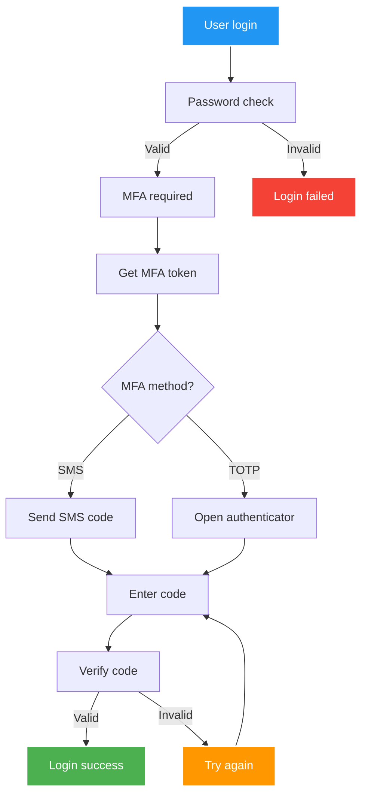

Multi-factor authentication (MFA) adds a **second layer of security** to the login process. Instead of relying only on a password, users also verify their identity with something they own, like a phone or authenticator app.  

Protekt supports **SMS codes**, **TOTP authenticator apps**, and **recovery codes**

## How MFA Works

When MFA is enabled, the login flow changes:  

1. Users enter their email and password.  
2. If the credentials are valid, Protekt issues an `mfa_token` instead of full access tokens.  
3. The user must complete an MFA challenge (SMS, authenticator app, or recovery code).  
4. Once validated, Protekt exchanges the `mfa_token` for access tokens.  

This ensures that even if a password is stolen, the account remains protected.  

## MFA Flow Diagram



**The key difference:** Instead of receiving access tokens after password validation, you get an `mfa_token` that must be used with a verification code to complete authentication.

## Enabling MFA in Your Application

1. Go to the Security section in the [Protekt Dashboard](dashboard.protekt.dev)
2. Enable Multi-Factor Authentication.
3. Choose the methods you want to support:
    - SMS → configure your SMS template and credits.
    - TOTP → customize the issuer name for authenticator apps.

## Implementation Overview

MFA implementation follows this pattern: check if a user has MFA enabled during login, present the appropriate challenge, verify their response, and handle success or failure appropriately.

import Tabs from '@theme/Tabs';
import TabItem from '@theme/TabItem';

### Step 1: Detecting MFA Requirements

When users log in, Protekt will tell you if they need to complete MFA. Instead of receiving tokens immediately, you'll get an MFA token that you use for the verification process.

<Tabs>
<TabItem value="javascript" label="JavaScript">

```javascript
async function loginWithMFA(email, password) {
  try {
    const result = await protekt.login({
      username: email,
      password: password
    });
    
    // Check if MFA is required
    if (result.mfa_required) {
      return {
        requiresMFA: true,
        mfaToken: result.mfa_token,
        availableMethods: result.available_factors
      };
    }
    
    // Regular login without MFA
    return {
      requiresMFA: false,
      tokens: result
    };
    
  } catch (error) {
    throw new Error(`Login failed: ${error.message}`);
  }
}
```

</TabItem>
<TabItem value="python" label="Python">

```python
def login_with_mfa(email, password):
    try:
        result = protekt.authentication.login({
            'username': email,
            'password': password,
            'grant_type': 'password'
        })
        
        # Check if MFA is required
        if result.get('mfa_required'):
            return {
                'requires_mfa': True,
                'mfa_token': result['mfa_token'],
                'available_methods': result.get('available_factors', [])
            }
        
        # Regular login without MFA
        return {
            'requires_mfa': False,
            'tokens': result
        }
        
    except Exception as error:
        raise Exception(f"Login failed: {str(error)}")
```

</TabItem>
</Tabs>

### Step 2: Enrolling Users

Before users can use MFA, they need to enroll at least one method. This typically happens in a settings page where users can add SMS or authenticator apps.

<Tabs>
<TabItem value="javascript" label="JavaScript">

```javascript
async function enrollSMS(phoneNumber) {
  try {
    const accessToken = await protekt.getTokenSilently();
    
    const enrollment = await protekt.mfa.enroll({
      type: 'sms',
      phone_number: phoneNumber
    }, accessToken);
    
    // SMS enrollment is immediate
    return {
      success: true,
      enrollmentId: enrollment.id
    };
    
  } catch (error) {
    throw new Error(`SMS enrollment failed: ${error.message}`);
  }
}

async function enrollTOTP() {
  try {
    const accessToken = await protekt.getTokenSilently();
    
    const enrollment = await protekt.mfa.enroll({
      type: 'otp'
    }, accessToken);
    
    // Show QR code and secret to user
    return {
      qrCodeUrl: enrollment.barcode_uri,
      manualEntryKey: enrollment.secret,
      enrollmentId: enrollment.id
    };
    
  } catch (error) {
    throw new Error(`TOTP enrollment failed: ${error.message}`);
  }
}
```

</TabItem>
<TabItem value="python" label="Python">

```python
def enroll_sms(phone_number, access_token):
    try:
        enrollment = protekt.mfa.enroll({
            'type': 'sms',
            'phone_number': phone_number
        }, access_token)
        
        return {
            'success': True,
            'enrollment_id': enrollment['id']
        }
        
    except Exception as error:
        raise Exception(f"SMS enrollment failed: {str(error)}")

def enroll_totp(access_token):
    try:
        enrollment = protekt.mfa.enroll({
            'type': 'otp'
        }, access_token)
        
        return {
            'qr_code_url': enrollment['barcode_uri'],
            'manual_entry_key': enrollment['secret'],
            'enrollment_id': enrollment['id']
        }
        
    except Exception as error:
        raise Exception(f"TOTP enrollment failed: {str(error)}")
```

</TabItem>
</Tabs>

### Step 3: Confirming TOTP Enrollment

When users enroll in TOTP, they need to prove they can generate valid codes before the enrollment is complete. After they scan the QR code or enter the secret manually, ask them to enter a code from their authenticator app.

<Tabs>
<TabItem value="javascript" label="JavaScript">

```javascript
async function confirmTOTPEnrollment(enrollmentId, verificationCode) {
  try {
    const accessToken = await protekt.getTokenSilently();
    
    await protekt.mfa.confirmEnrollment(
      enrollmentId,
      { otp: verificationCode },
      accessToken
    );
    
    return { success: true };
    
  } catch (error) {
    throw new Error(`TOTP confirmation failed: ${error.message}`);
  }
}
```

</TabItem>
<TabItem value="python" label="Python">

```python
def confirm_totp_enrollment(enrollment_id, verification_code, access_token):
    try:
        protekt.mfa.confirm_enrollment(
            enrollment_id,
            {'otp': verification_code},
            access_token
        )
        
        return {'success': True}
        
    except Exception as error:
        raise Exception(f"TOTP confirmation failed: {str(error)}")
```

</TabItem>
</Tabs>

### Step 4: Handling MFA Challenges

When login requires MFA, prompt the user for their chosen method.

<Tabs>
<TabItem value="javascript" label="JavaScript">

```javascript
async function challengeMFA(mfaToken, preferredMethod = 'sms') {
  try {
    const challenge = await protekt.mfa.challenge({
      mfa_token: mfaToken,
      challenge_type: preferredMethod
    });
    
    if (preferredMethod === 'sms') {
      // SMS sent automatically, just wait for user input
      return {
        challengeType: 'sms',
        message: 'SMS code sent to your phone'
      };
    }
    
    if (preferredMethod === 'otp') {
      // User needs to check their authenticator app
      return {
        challengeType: 'otp',
        message: 'Enter code from your authenticator app'
      };
    }
    
  } catch (error) {
    throw new Error(`MFA challenge failed: ${error.message}`);
  }
}
```

</TabItem>
<TabItem value="python" label="Python">

```python
def challenge_mfa(mfa_token, preferred_method='sms'):
    try:
        challenge = protekt.mfa.challenge({
            'mfa_token': mfa_token,
            'challenge_type': preferred_method
        })
        
        if preferred_method == 'sms':
            return {
                'challenge_type': 'sms',
                'message': 'SMS code sent to your phone'
            }
        
        if preferred_method == 'otp':
            return {
                'challenge_type': 'otp',
                'message': 'Enter code from your authenticator app'
            }
            
    except Exception as error:
        raise Exception(f"MFA challenge failed: {str(error)}")
```

</TabItem>
</Tabs>

### Step 5: Verifying MFA Codes

Once users enter their verification code, send it to Protekt for validation. If the code is correct, you'll receive the access tokens needed for authenticated requests.

<Tabs>
<TabItem value="javascript" label="JavaScript">

```javascript
async function verifyMFA(mfaToken, verificationCode) {
  try {
    const result = await protekt.mfa.verify({
      mfa_token: mfaToken,
      otp: verificationCode
    });
    
    // MFA successful - store tokens
    localStorage.setItem('access_token', result.access_token);
    localStorage.setItem('id_token', result.id_token);
    localStorage.setItem('refresh_token', result.refresh_token);
    
    return {
      success: true,
      tokens: result
    };
    
  } catch (error) {
    // Handle specific error types
    if (error.error === 'invalid_grant') {
      throw new Error('Invalid verification code');
    }
    
    if (error.error === 'expired_token') {
      throw new Error('Verification code expired. Please request a new one.');
    }
    
    throw new Error(`MFA verification failed: ${error.message}`);
  }
}
```

</TabItem>
<TabItem value="python" label="Python">

```python
def verify_mfa(mfa_token, verification_code):
    try:
        result = protekt.mfa.verify({
            'mfa_token': mfa_token,
            'otp': verification_code
        })
        
        # Store tokens in session or database
        session['access_token'] = result['access_token']
        session['id_token'] = result['id_token']
        session['refresh_token'] = result['refresh_token']
        
        return {
            'success': True,
            'tokens': result
        }
        
    except Exception as error:
        # Handle specific error types
        if hasattr(error, 'error') and error.error == 'invalid_grant':
            raise Exception('Invalid verification code')
        
        if hasattr(error, 'error') and error.error == 'expired_token':
            raise Exception('Verification code expired. Please request a new one.')
        
        raise Exception(f"MFA verification failed: {str(error)}")
```

</TabItem>
</Tabs>

:::info
Always provide users with recovery options in case they lose access to their MFA device. Generate backup codes during enrollment and allow users to download them.
:::

## Next Steps

Once you have basic MFA working, consider advanced features like adaptive MFA that only triggers under suspicious circumstances, or WebAuthn for hardware security keys. You can also implement MFA policies that require certain user groups to enable MFA.

For production deployments, monitor your MFA success rates and user feedback. Some users may need additional support understanding how to use authenticator apps or may have issues receiving SMS in certain regions.